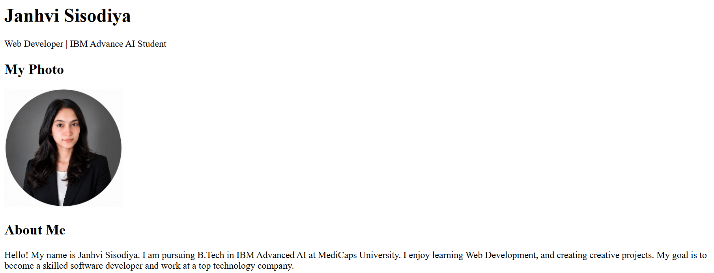
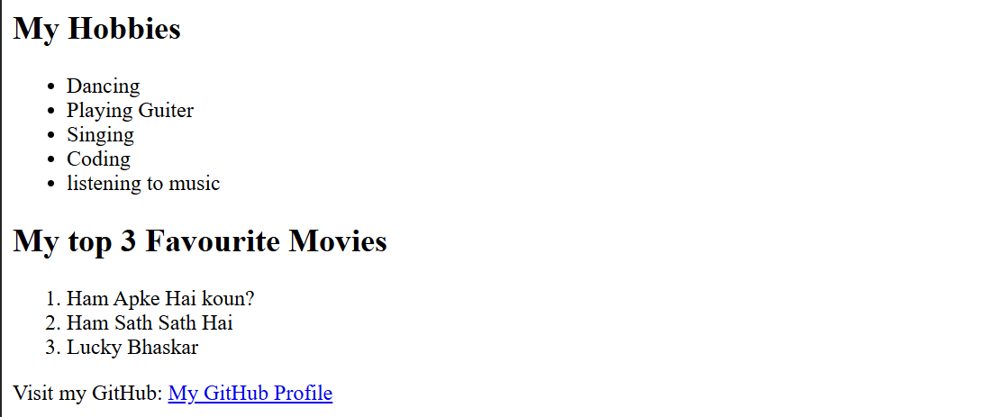
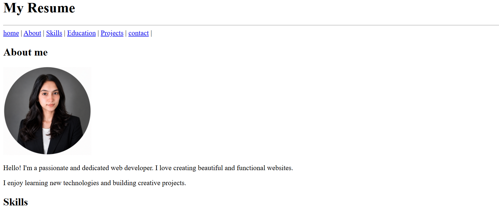
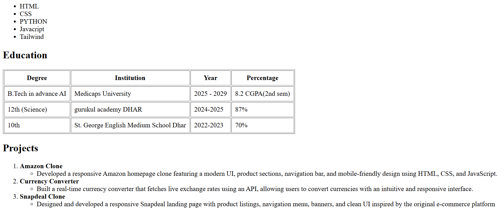
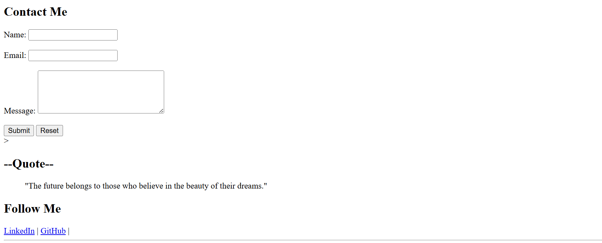
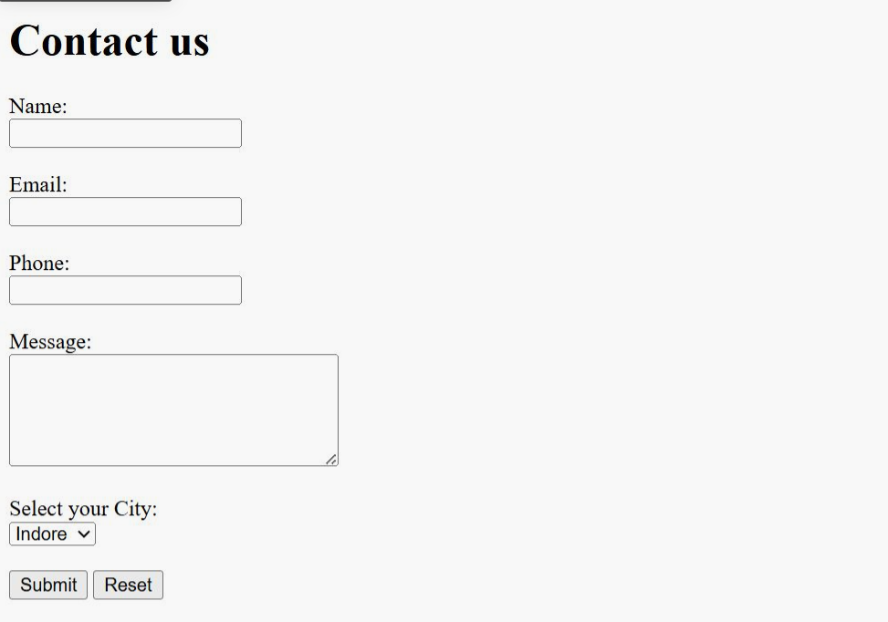

# HTML Projects

This repository contains three beginner-friendly HTML projects created to practice the fundamentals of HTML, including semantic elements, forms, lists, tables, and page structure.

## 📂 Projects Included

### 1. Personal Bio Page
A simple personal portfolio page that includes:
- Name and profile photo
- About Me section
- Hobbies list
- Favorite movies/shows
- GitHub profile link
- Semantic HTML tags (`header`, `main`, `section`, `footer`)

## 📸 Preview

### 2. Resume
A basic resume webpage that showcases:
- Personal information
- Career objective
- Education details
- Skills
- Projects
- Contact information

## 📸 Preview

### 3. Contact Us Form
A fully structured contact form featuring:
- Name, Email, Phone, and Message fields
- City dropdown
- Submit and Reset buttons

## 📸 Preview

## 👩‍💻 Author

**Janhvi Sisodiya**

GitHub: https://github.com/janhvisisod2007-ux